# Genomic Flow Applications

Genomic Flow Applications (or GFA for short) is the serverless compute infrastructure developed by SBA to host genomics-optimized applications with dynamic scaling using AWS Fargate and ECS.

## Flow Diagram

### Summary

To get started with Genomic Flow Applications, you may either use an existing containerized image (currently only Amazon Linux 2 based instances are supported) or utilize SBA Application Design to create 

```mermaid
flowchart TB
    subgraph SBA-Application-Design
    Consultation --Quote--> Design ---> C{Test}
    C -->|Approved| D[Genomic-Flow]
    C -->|Denied| Consultation
    end
    subgraph Existing-Application
    Quote --> Docker-Image
    Docker-Image --> E{Test}
    end
    SBA-Application-Design ---> Genomic-Flow
    Existing-Application ---> Genomic-Flow
    subgraph Genomic-Flow
    SBA-Application --> Amazon-ECR --> Amazon-ECS
    Public-Container --> Amazon-ECS
    SBA-GenomicFlow --> Amazon-ECS
    Amazon-ECS --> Web-Application
    end
  
style SBA-Application-Design fill:#10,stroke:#333,stroke-width:4px
style Genomic-Flow fill:#000,stroke:#333,stroke-width:4px
style Existing-Application fill:#10,stroke:#333,stroke-width:4px
style Consultation fill:#390,stroke:#333,stroke-width:4px
style Quote fill:#390,stroke:#333,stroke-width:4px
style C fill:#701,stroke:#333,stroke-width:4px
style E align:center,fill:#701,stroke:#333,stroke-width:4px
style D fill:#000,stroke:#333,stroke-width:4px
style Design fill:#841,stroke:#333,stroke-width:4px
style Docker-Image fill:#0073ec,stroke:#333,stroke-width:4px
style Public-Container fill:#0073ec,stroke:#333,stroke-width:4px
```

